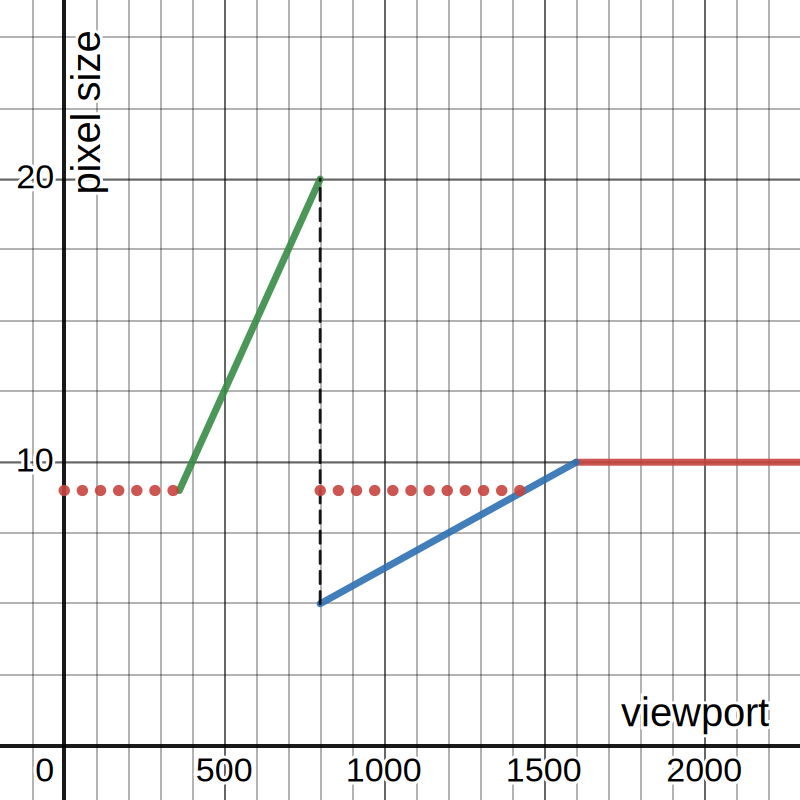

# Tailwind property syntax

Some UI component have special properties (attributes) on them that makes it easier/faster to write
bulletproof UI. Most of them map easily to tailwind (`padding="4"` --> `p-4`) while others might
need more explanation to fully grasp (`rhythm=4` --> `pt-4`).

## Why? This is crazy!

Not all css properties (or tailwind classes) are equal. Some go well with others. Some cannot live
without others: they need to be combined to achieve something useful. On the other hand, css lets
you mix incompatibles properties which can lead to defects.

Html elements are also not equal. Some have a special html semantic, but using `<nav>` instead of
another element does not convey information about their role in the UI tree. Html elements can have
a ton of responsibilities and be used to play different roles. This results in some `<div>` being
fundamentally different from other `<div>`.

Composition is great, and we believe tailwind is an awesome way to build websites. We also believe
composition should be safe, pure (without side effects) and should _always_ work.

We understand that the bulk of the design/creation process is not done in code. We need a quick way
to mimic as closely as possible the options given to UI designers in the tools they use and in the
language they think/create/design/live with. We need a way to replicate, name and document recipes
that always work. This gives us the power of quick iteration/feedback loop.

On top of that, we can make pure, side-effect-free components, where most of the input corresponds
to a type, which makes our code sounder and safer. It also gives us a powerful way to express
intention without the need for comments. Naming concepts and using them as types automatically
denotes intention.

Rules are made to be broken. If the need arise, good ol' `<div class="text-40">` is your friend. If
its responsibility is not 100% obvious, please add a comment.

## Responsiveness

Most sizes will be implemented in rems. We define rems to be relative to a ratio of vw units (see
`src/lib/css/viewport.css`). _We do support a single breakpoint_, called `bp`, where the ratio of vw
changes. We also have limits where values are not tied to the viewport width anymore. The `min`
limit caps the value to 9px and the `max` limit caps it to 10px.

The only quirk is that it does not work in all Safaris, when the font-size is less than 9px. The
dotted line denoted the alternate value we get in some Safaris.

[](https://www.desmos.com/calculator/dhkjr16m9c)

All values are considered 'mobile' by default (mobile-first ¯\_(ツ)\_/¯). In order to specify a
different value for desktop, values need to be separated by a pipe symbol `|`. ex.: `4|8`, which
reads `Mobile Four, Desktop Eight`.

## How it works

There are two sides to take care of and both implementations must be kept in sync.

1. Build: Feeding tailwind's jit engine with the proper classes so it will generate them.
2. Runtime: Rendering the proper classes at runtime.

### Feeding the dragon

The build phase is controlled by
[property-to-class.cjs](../tailwind/transform/property-to-class.cjs). It literally rewrites each
svelte file before tokenization by purgecss. It rewrites TypeScript declarations as well as the
property syntax.

Takes this 👇 valid svelte file

```svelte
<script lang="ts">
	import { tailwindify } from '$lib/tailwind/tailwind';
	import type { PxUnit } from './units';

	export let rhythm: PxUnit = '20';

	const classes = (): string => {
		let c = `relative min-w-0`;
		if (rhythm) {
			c = `${c} ${tailwindify('pt', rhythm)}`;
		}
		return c;
	};
</script>

<div class={classes()}>
	<Frame padding="20|32" background="alt">...</Frame>
</div>
```

...becomes this 👇 after the first pass

```svelte
<script lang="ts">
	import { tailwindify } from '$lib/tailwind/tailwind';
	import type { PxUnit } from './units';

	export rhythm="20";

	const classes = (): string => {
		let c = `relative min-w-0`;
		if (rhythm) {
			c = `${c} ${tailwindify('pt', rhythm)}`;
		}
		return c;
	};
</script>

<div class={classes()}>
	<Frame padding="20" bp:padding="32" background="yellow">...</Frame>
</div>
```

...and ends like this 👇

```svelte
<script lang="ts">
	import { tailwindify } from '$lib/tailwind/tailwind';
	import type { PxUnit } from './units';

	export pt-20;

	const classes = (): string => {
		let c = `relative min-w-0`;
		if (rhythm) {
			c = `${c} ${tailwindify('pt', rhythm)}`;
		}
		return c;
	};
</script>

<div class={classes()}>
	<Frame p-20 bp:p-32 bg-[yellow]>...</Frame>
</div>
```

In the previous example, it transformed the property `padding` into the classes `p-20 bp:p-32` and
the property `background` into class `bg-yellow` from the `Frame` element. It also found class
`pt-20` as being the default for property `rhythm="20"`!

Using `tailwindify` to deal with the class generation is the way to handle the runtime part. It
essentially binds the prefix to the prop. See
[Rendering proper tailwind classes](#rendering-proper-tailwind-classes) and
[Adding new types to `tailwindify()`](#adding-new-types-to-tailwindify).

### Adding support for new props at build time

While you can always edit the `replacers` object directly in [the
file]](../tailwind/transform/property-to-class.cjs) there is also a special file,
[properties.json](../src/lib/tailwind/properties.json), which allows users to extend the code
externally. Rules with an equal sign (`=`) in their key are processed before those without. This
allows us to rewrite the value for special cases.

On the other hand, that's where using `tailwindify()` (or
`tailwindifyWithMin`/`tailwindifyAspectRatio`) to generate your classes really shines: It will
automatically _promote_ your props into a replacer, using a default prefix per function:

1. `tailwindify()`: Uses the base replacer, i.e. `${prefix}-$2`.
2. `tailwindifyWithMin()`: Uses the base replace, but with an extra `min`:
   `${prefix}-$2 min-${prefix}-$2`.
3. `tailwindifyAspectRatio()`: Uses the predefined ratio function.

Properties still can only be bounded to a single prefix per project. You will get a build error if
you violate this.

### Rendering proper tailwind classes

In order to make our dev experience better and runtime safer, we heavily (ab)use TypeScript types.
Tailwind classes are composed of an optional media query, a property and a value. We can then add
type validation on element instanciation and also when mapping properties to valid tailwind property
prefix. As seen in the previous snippets, we have a `tailwindify` function that properly deals with
this, located in [src/lib/tailwind/tailwind.ts](../src/lib/tailwind/tailwind.ts).

## Adding new types to `tailwindify()`

Properties can be reused across the board without any intervention. Their type can be different, as
long as it leads to valid tailwind classes. _The property to tailwind prefix mapping cannot be
changed_. We need to be creative with the naming.

Let's say we want to add a new property, `abc` to our vocabulary.

1. Find out the domain, i.e. the set of all possible valid values. Existing types are found in
   `src/lib/tailwind/units.ts`. If no valid type exist, try to create one. If it fails, use a string
   (with caution, we loose soundness and auto-complete).
2. We wrote `ABCUnit` for our case. It is defined as

```ts
// Responsive<T> makes it possible to use the `mobile|desktop` syntax.
export type ABCUnit = Responsive<'a' | 'b' | 'c'>;
```

3. Make sure that the corresponding tailwind prefix exists. Existing `Tailwind*` types are found in
   `src/lib/tailwind/tailwind.ts`.
4. We create the missing `TailwindAbc` type. This type will map to the `abc` prefix when we will
   call `tailwindify('abc', _)` and will keep TypeScript happy. We can not longer make typos!
5. If the property is not available in `tailwind/transform/property-to-class.cjs`, add the new
   property to `src/lib/tailwind/properties.json`. Since it is a direct match (no need to replace
   the value), we add `"abc": "$1-$2"`. The value is used in a `string.replace()` call as the
   replace expression. `$1` is the property name, `$2` is the property value.
6. We can now enjoy the fruits of our labor and declare our first `abc` property.

```ts
export let abc: ABCUnit = 'b'; // <-- This is type safe

// Property is type safe ----v
const classes = tailwindify('abc', abc);
// Value is also type safe ---------^
```

```svelte
<!-- This is type safe and supports auto-completion -->
<ABC abc="c">
```
