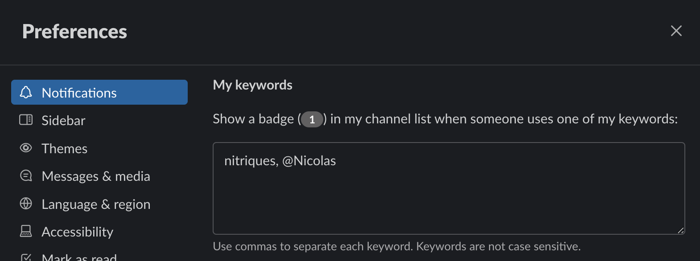

# Slack integration

We use slack a lot. Each project has its own slack channel, where **all** project related
communication happens.

## Bots

We have many bots available: Figma, Google Calendar, Github, Vercel and custom webhooks. The most
important are related to deploys (Vercel for sveltekit, Webhook for CMS). Take your time to explore
them all.

## Alternate usernames

If your github username is not the same as the one you use in Slack, setting up alternate usernames
in slack will notify you when bots use your github username, like if your were @-ed with your slack
handle.

Open Preferences > Notification, then scroll to the "My Keywords" section. Add your github username
(and all other aliases) in the textbox.

