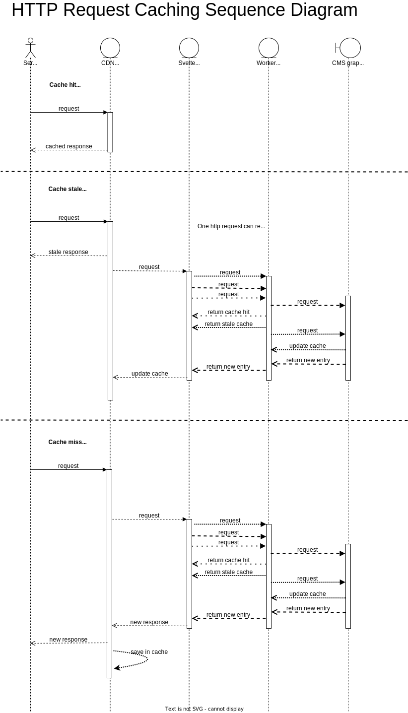

# Request Life Cycle

Here's a flow diagram showing the possible outcome when generating a page or rendering a load
function. Request can either generate a cache miss, stale or hit response. We use the stale state as
both a performance gain (since we will update the cache behind the scenes) and as a fail over
mechanism, since users are not exposed to error if the background update fails. This phenomenon is
present at the CDN level (where we keep a cache of html/json responses) and at the worker cache
level (where graphql responses are cached).

[Source](https://app.diagrams.net/#G1HnlDXW3sPTbMFToqr6T8FaUITJKUeZi5)
