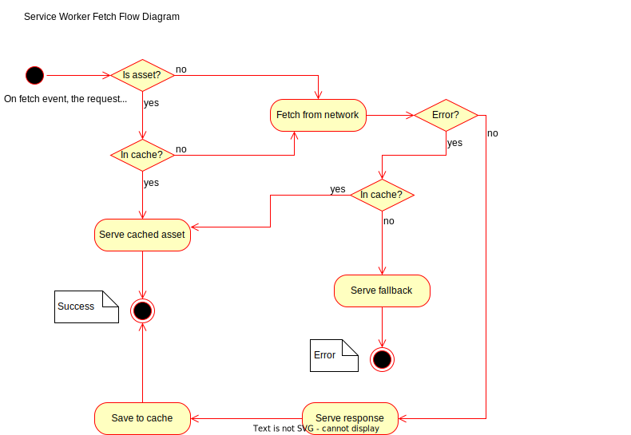

# Service worker

The starter kit comes with a default [service worker](https://kit.svelte.dev/docs/service-workers)
implementation. The service worker code is located in
[`src/service-worker.ts`](../src/service-worker.ts). In supported browsers, it will handle _all_
requests made by the user, including external references and all code assets.

The mechanism for service worker updates uses the content of the file to check if a new service
worker needs to be registered. Sveltekit handles this for us by injecting a `version` variable into
the code, which gets updated on each build.

The current service worker implementation is pretty simple: it will default to fetching on the
network for all urls, except if the url is a build asset. Since those are immutable, we can serve
them from cache all the time.

The following flow diagram shows the logic applied to all fetch events.

[Source](https://app.diagrams.net/#G1HnlDXW3sPTbMFToqr6T8FaUITJKUeZi5)
